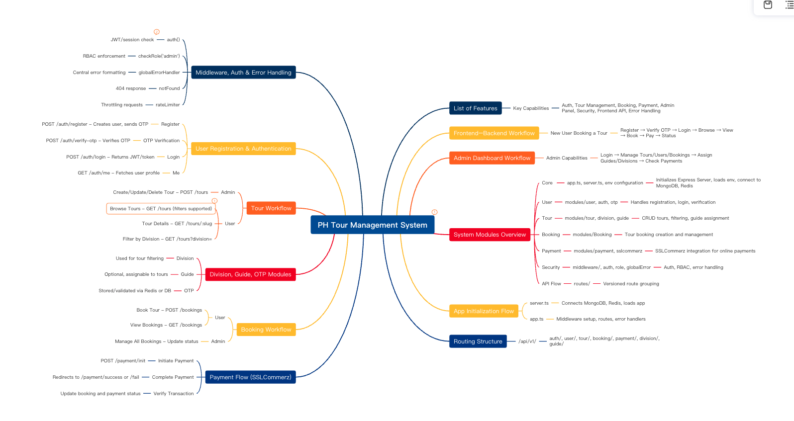
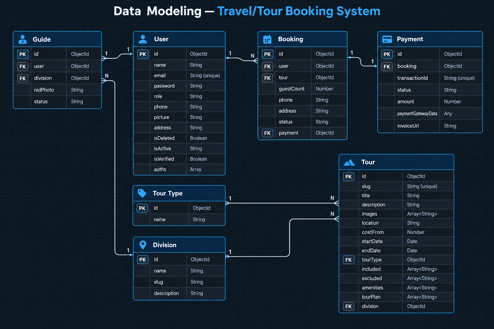

# Project Workflow (Pre-Dev)

Project শুরু করার পর ক্লায়েন্টের requirement বোঝা থেকে শুরু করে ERD design ও API endpoints লেখা পর্যন্ত যে ধাপগুলো অনুসরণ করা হবে, তা নিচে সাজানো হলো।

---

## ১. Client Requirements Doc

Project শুরু করার পর client-এর doc বা requirements অনুযায়ী একটা doc বানাবো, তারপর সেটা ভালোভাবে পড়ে নেবো।

**Teacher's Project Requirements Link:**
https://docs.google.com/document/d/1XRN18ClObPMJGKl7CfZFBLeZuJf2h8JOBc_crzuWtT4/edit?tab=t.0

**আমার Project Requirements Link:**
https://github.com/arifucoder/dev-starter-guides/blob/main/sdlc-docs/mern/project-workflow-assets/requirements-analysis.md

---

## ২. Mind Map (GitMind)

GitMind-এ গিয়ে new mind নেবো এবং পুরো সিস্টেমের feature, module, workflow ইত্যাদি mind map আকারে সাজাবো।

**Teacher's GitMind:**
https://gitmind.com/app/docs/mzkbj5o2

---

## ৩. Data Modeling (Google Docs)

এই ধাপে Google Docs-এ Entities এবং তাদের Attributes লিখে data modeling করার চেষ্টা করবো।

**Example — User Entity:**

- name: String
- email: String (unique)
- password: String
- role: String (e.g., Admin, User)
- phone: String
- picture: String
- address: String
- isDeleted: Boolean
- isActive: String (e.g., Active, Inactive)
- isVerified: Boolean
- auths: Array of auth providers (e.g., Google, Facebook)

**Teacher's Data Modeling Link:**
https://docs.google.com/document/d/1NSELQ7_jUx4xLGchef4HT3_9YqDWrdzUUGMZWmD2lY0/edit?tab=t.0#heading=h.pl2ufwjd3891

---

## ৪. ERD Design (draw.io)

এই ধাপে ERD দিয়ে database design করবো।

**Tool:**
https://app.diagrams.net/

---

## ৫. API Endpoints

সবশেষে সব API endpoints লিখে রাখবো।

**আমার Endpoints:**
https://github.com/arifucoder/dev-starter-guides/blob/main/sdlc-docs/mern/project-workflow-assets/api-endpoints.md

**Teacher's Endpoints Link:**
https://docs.google.com/document/d/1HysoioRCpSsGpSz8JQZRGii9GNkpdx0pEX-zHP2p334/edit?tab=t.0#heading=h.yduuanqd5g61